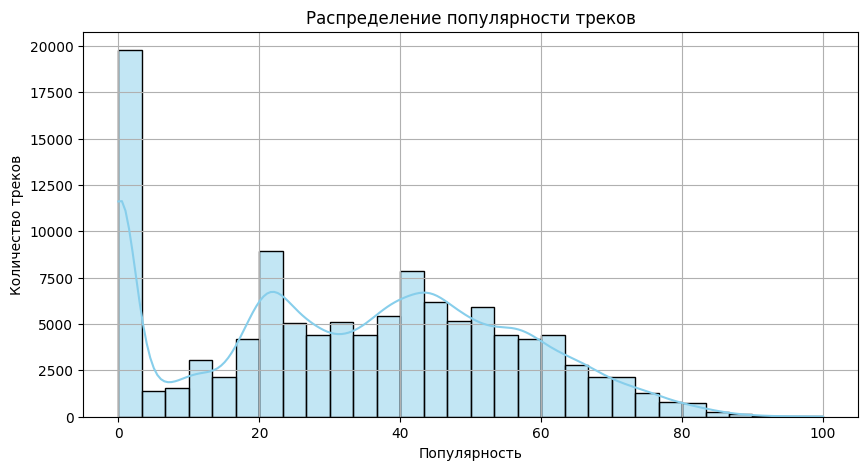
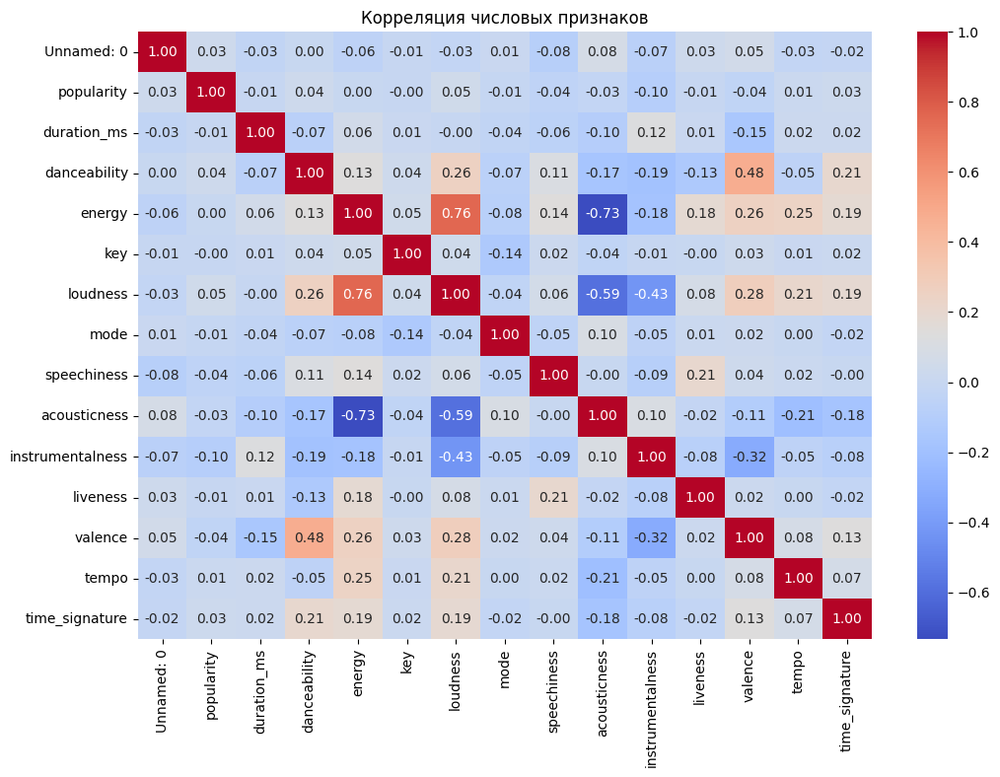
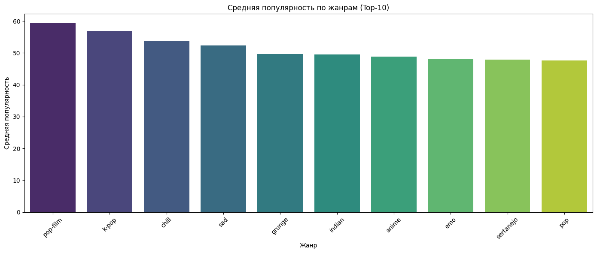
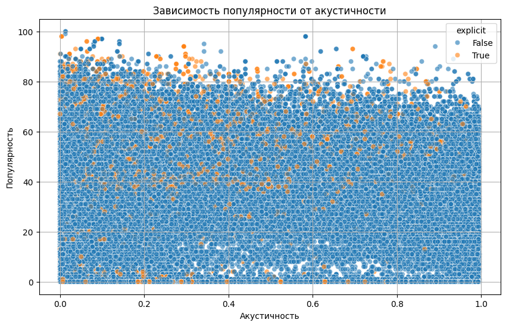
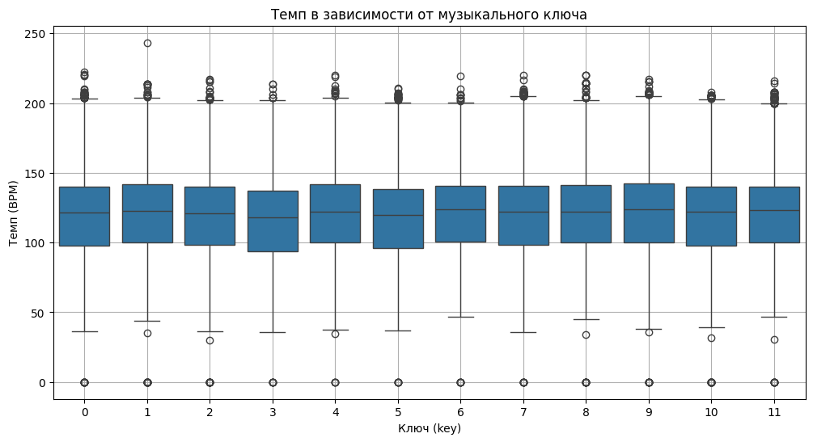
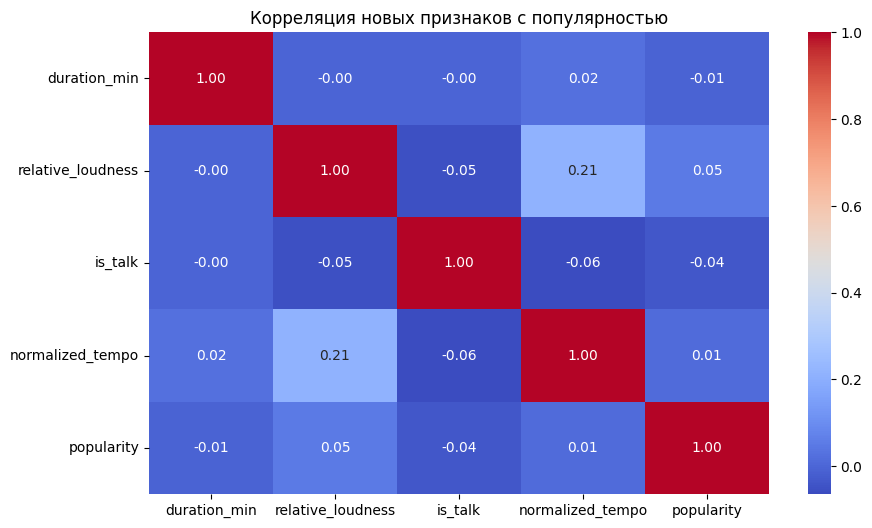
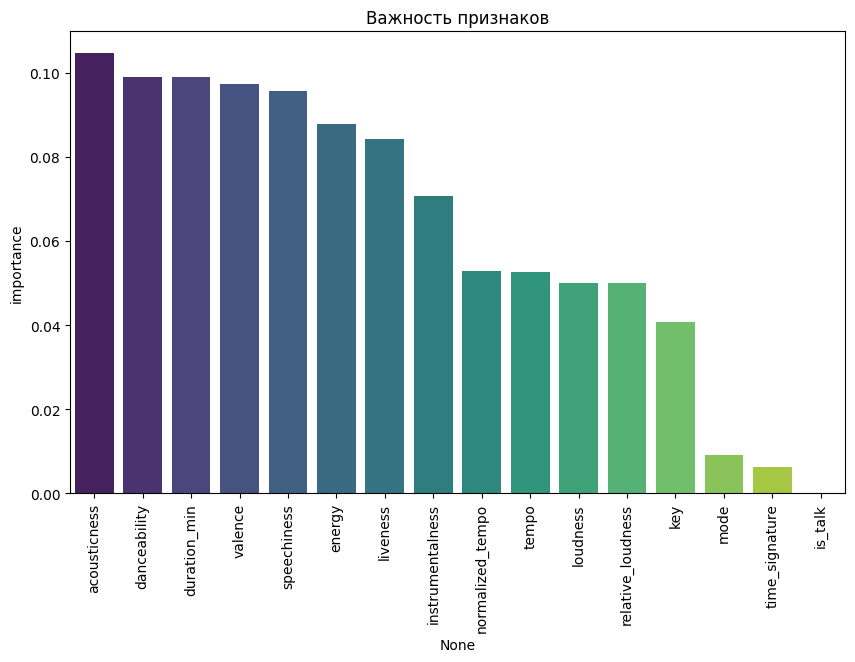

# EDA-анализ


```python
import pandas as pd
import seaborn as sns
import matplotlib.pyplot as plt
```


```python
# 1. Загрузка данных
df = pd.read_csv("dataset.csv")

print("Пропущенные значения:\n", df.isnull().sum())

#Заполнение пропущенных значений
df.fillna(0, inplace=True)
```

    Пропущенные значения:
     Unnamed: 0          0
    track_id            0
    artists             1
    album_name          1
    track_name          1
    popularity          0
    duration_ms         0
    explicit            0
    danceability        0
    energy              0
    key                 0
    loudness            0
    mode                0
    speechiness         0
    acousticness        0
    instrumentalness    0
    liveness            0
    valence             0
    tempo               0
    time_signature      0
    track_genre         0
    dtype: int64


```python
# 3. Описательная статистика
print("\nОписательная статистика:")
print(df.describe())
```

    
    Описательная статистика:
              Unnamed: 0     popularity   duration_ms   danceability  \
    count  114000.000000  114000.000000  1.140000e+05  114000.000000   
    mean    56999.500000      33.238535  2.280292e+05       0.566800   
    std     32909.109681      22.305078  1.072977e+05       0.173542   
    min         0.000000       0.000000  0.000000e+00       0.000000   
    25%     28499.750000      17.000000  1.740660e+05       0.456000   
    50%     56999.500000      35.000000  2.129060e+05       0.580000   
    75%     85499.250000      50.000000  2.615060e+05       0.695000   
    max    113999.000000     100.000000  5.237295e+06       0.985000   
    
                  energy            key       loudness           mode  \
    count  114000.000000  114000.000000  114000.000000  114000.000000   
    mean        0.641383       5.309140      -8.258960       0.637553   
    std         0.251529       3.559987       5.029337       0.480709   
    min         0.000000       0.000000     -49.531000       0.000000   
    25%         0.472000       2.000000     -10.013000       0.000000   
    50%         0.685000       5.000000      -7.004000       1.000000   
    75%         0.854000       8.000000      -5.003000       1.000000   
    max         1.000000      11.000000       4.532000       1.000000   
    
             speechiness   acousticness  instrumentalness       liveness  \
    count  114000.000000  114000.000000     114000.000000  114000.000000   
    mean        0.084652       0.314910          0.156050       0.213553   
    std         0.105732       0.332523          0.309555       0.190378   
    min         0.000000       0.000000          0.000000       0.000000   
    25%         0.035900       0.016900          0.000000       0.098000   
    50%         0.048900       0.169000          0.000042       0.132000   
    75%         0.084500       0.598000          0.049000       0.273000   
    max         0.965000       0.996000          1.000000       1.000000   
    
                 valence          tempo  time_signature  
    count  114000.000000  114000.000000   114000.000000  
    mean        0.474068     122.147837        3.904035  
    std         0.259261      29.978197        0.432621  
    min         0.000000       0.000000        0.000000  
    25%         0.260000      99.218750        4.000000  
    50%         0.464000     122.017000        4.000000  
    75%         0.683000     140.071000        4.000000  
    max         0.995000     243.372000        5.000000  


```python
# 4. Распределение популярности треков
plt.figure(figsize=(10, 5))
sns.histplot(df['popularity'], bins=30, kde=True, color='skyblue')
plt.title("Распределение популярности треков")
plt.xlabel("Популярность")
plt.ylabel("Количество треков")
plt.grid(True)
plt.show()
```


    

    


```python
#5 Корреляция числовых признаков
numeric_df = df.select_dtypes(include=['number'])

plt.figure(figsize=(12, 8))
sns.heatmap(numeric_df.corr(), annot=True, cmap="coolwarm", fmt=".2f")
plt.title("Корреляция числовых признаков")
plt.show()
```


    

    


```python
#6 Средняя популярность по жанрам
plt.figure(figsize=(14, 6))
genre_popularity = df.groupby("track_genre")["popularity"].mean().sort_values(ascending=False).head(10)
sns.barplot(x=genre_popularity.index, y=genre_popularity.values, palette='viridis')
plt.title("Средняя популярность по жанрам (Top-10)")
plt.xlabel("Жанр")
plt.ylabel("Средняя популярность")
plt.xticks(rotation=45)
plt.tight_layout()
plt.show()
```

    C:\Users\daudk\AppData\Local\Temp\ipykernel_8836\826900241.py:4: FutureWarning: 
    
    Passing `palette` without assigning `hue` is deprecated and will be removed in v0.14.0. Assign the `x` variable to `hue` and set `legend=False` for the same effect.
    
      sns.barplot(x=genre_popularity.index, y=genre_popularity.values, palette='viridis')


    

    


```python
#7 Влияние акустичности на популярность
plt.figure(figsize=(10, 6))
sns.scatterplot(data=df, x="acousticness", y="popularity", hue="explicit", alpha=0.6)
plt.title("Зависимость популярности от акустичности")
plt.xlabel("Акустичность")
plt.ylabel("Популярность")
plt.grid(True)
plt.show()
```


    

    


```python
#8 Выборки по ключу и темпу
plt.figure(figsize=(12, 6))
sns.boxplot(data=df, x="key", y="tempo")
plt.title("Темп в зависимости от музыкального ключа")
plt.xlabel("Ключ (key)")
plt.ylabel("Темп (BPM)")
plt.grid(True)
plt.show()
```


    

    


# Feature Engineering


```python
from sklearn.model_selection import train_test_split
from sklearn.ensemble import RandomForestRegressor
from sklearn.linear_model import LinearRegression
from sklearn.metrics import mean_squared_error
import numpy as np
```


```python
# Длительность трека в минутах
df['duration_min'] = df['duration_ms'] / 60000

# Относительная громкость
df['relative_loudness'] = df['loudness'] - df['loudness'].min()

# Состояние
df['is_talk'] = df['speechiness'] > 0.66

# Нормированый темп
df['normalized_tempo'] = (df['tempo'] - df['tempo'].min()) / (df['tempo'].max() - df['tempo'].min())

# Корреляция
new_features = ['duration_min', 'relative_loudness', 'is_talk', 'normalized_tempo']
corr_matrix = df[new_features + ['popularity']].corr()

# Визуализация корреляции новых признаков с целевым показателем
plt.figure(figsize=(10, 6))
sns.heatmap(corr_matrix, annot=True, cmap="coolwarm", fmt=".2f")
plt.title("Корреляция новых признаков с популярностью")
plt.show()

# Важность признаков с помощью Random Forest
X = df[['duration_min', 'relative_loudness', 'is_talk', 'normalized_tempo', 'danceability', 'energy', 'key', 'loudness', 'mode', 'speechiness', 'acousticness', 'instrumentalness', 'liveness', 'valence', 'tempo', 'time_signature']]
y = df['popularity']

# Разбиение: данные → обучающая выборка + тестовая выборка
X_train, X_test, y_train, y_test = train_test_split(X, y, test_size=0.2, random_state=42)

# Обучение модели Random Forest
rf = RandomForestRegressor(n_estimators=100, random_state=42)
rf.fit(X_train, y_train)

# Важность признаков
feature_importances = pd.DataFrame(rf.feature_importances_, index=X.columns, columns=['importance']).sort_values('importance', ascending=False)

# Визуализация важности признаков
plt.figure(figsize=(10, 6))
sns.barplot(x=feature_importances.index, y=feature_importances['importance'], palette='viridis')
plt.title("Важность признаков")
plt.xticks(rotation=90)
plt.show()

# 4. Построение простой модели линейная регрессии
lr = LinearRegression()
lr.fit(X_train, y_train)

# Прогнозирование на тетовой выборке
y_pred = lr.predict(X_test)

# Оценка модели
mse = mean_squared_error(y_test, y_pred)
rmse = np.sqrt(mse)

print(f"RMSE модели линейной регрессии: {rmse:.2f}")
```


    

    


    C:\Users\daudk\AppData\Local\Temp\ipykernel_8836\1778240820.py:39: FutureWarning: 
    
    Passing `palette` without assigning `hue` is deprecated and will be removed in v0.14.0. Assign the `x` variable to `hue` and set `legend=False` for the same effect.
    
      sns.barplot(x=feature_importances.index, y=feature_importances['importance'], palette='viridis')


    

    


    RMSE модели линейной регрессии: 21.98

